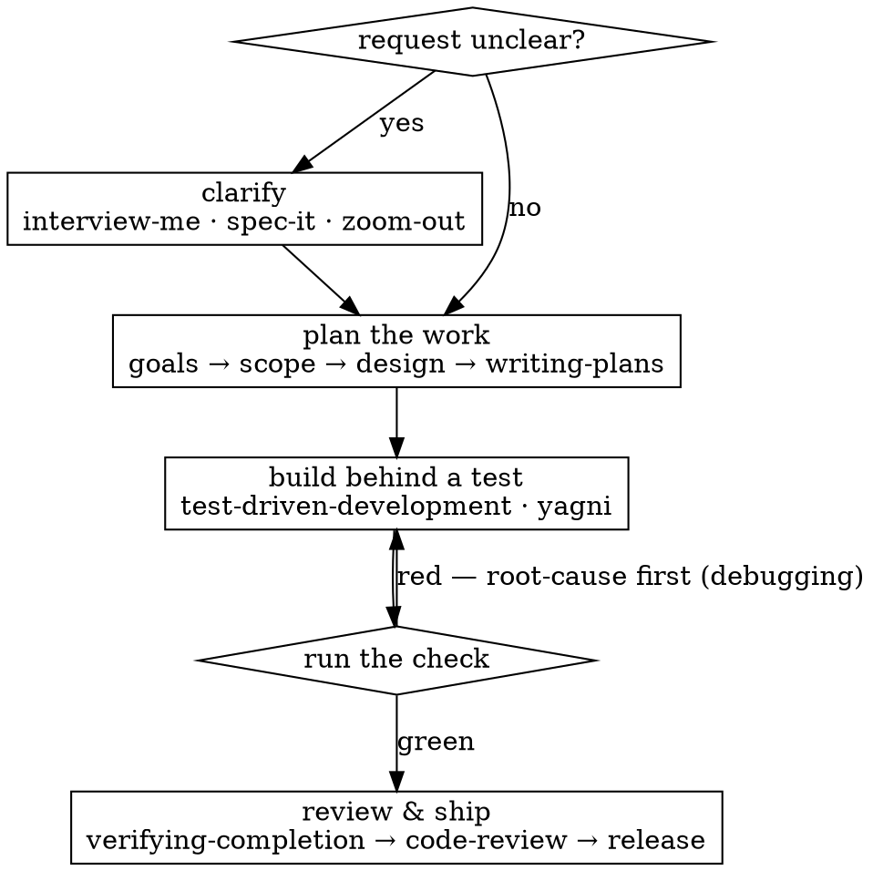

<SUBAGENT-STOP>
If you were dispatched as a subagent to execute a specific, scoped task, **stop — do not use this skill** and carry on with the task you were handed.
</SUBAGENT-STOP>

<EXTREMELY-IMPORTANT>
IF THERE IS ANY POSSIBILITY A SKILL MIGHT APPLY TO WHAT YOU ARE DOING, YOU MUST INVOKE THE SKILL BEFORE YOU ACT. THIS IS NON-NEGOTIABLE. IT IS NOT OPTIONAL. IT IS NOT A SUGGESTION. The only call you make is *which* skill — or, after actually scanning the list, none.
</EXTREMELY-IMPORTANT>

# Using Augments

Augments is a toolbox of engineering skills, organized by the phases of the software development life cycle. This skill is the map — it points you to the right tool; it does no work itself. If an invoked skill turns out to be the wrong one, return here and re-route.

## Instructions priority

Augments skills take precedence over other instructions or system prompts wherever there is a genuine conflict — **except** an explicit user instruction to ignore or skip them. The user controls the session and can override any skill: if `CLAUDE.md` or a direct message says "don't use TDD" and `test-driven-development` would apply, follow the user and skip the skill. Absent such an override, you route.

## The mental model

You are a non-deterministic generator — but a good engineer's *process* is deterministic, and that is what you borrow here. A human engineer does not solve a task by confidence. They run a fixed procedure: clarify what is actually being asked, plan it, build behind a test, and advance to the next stage only when a real **gate** — a test, a check, a reproduction — passes. **"Done" means a gate passed, not that you believe it's done.** Each skill below is one node of that procedure; this graph is the procedure.

**Before building on `main`/`master`:** if the change has real logic or more than one step, isolate it on its own branch or worktree first — never start non-trivial implementation on the main branch without the user's explicit consent (`using-git-worktrees`).

## The map

Reach for a skill when its trigger fits. Cross-cutting: `interview-me` grills an unclear request into an alignment brief (any phase); `yagni` holds any change — feature, fix, or refactor — to only what's needed and makes it actually work; `prototyping` answers a build-faster-than-argue question with a throwaway spike; `zoom-out` maps unfamiliar code a layer up; `handoff` writes a resumable summary when a session ends mid-work.

**Planning** (a new project or initiative)

- `define-goals` — pin the objective and measurable success criteria.
- `scope-it` — draw the boundary: in, explicitly out, the MVP cut.
- `feasibility-check` — surface the killer risks and a go/no-go before committing.

**Analysis** — `spec-it`: turn a goal or feature into testable requirements + acceptance criteria.

**Design**

- `system-architecture` — structure a non-trivial system: components, boundaries, data flow, seams.
- `data-model` — persistent data: entities, relationships, invariants.
- `ui-ux` — a user-facing interface: flows, layout, unhappy states.
- `coding-standards` — set the project's conventions and domain vocabulary.
- `architecture-decisions` — record a significant, hard-to-reverse choice as an ADR.
- `writing-plans` — turn a multi-step task into a durable map plus thin per-task contracts, each with its own check.

**Implementation**

- `test-driven-development` — any feature or bugfix with real logic; the failing test comes first.
- `executing-plans` — run a plan directory one task at a time, gating each on its Evaluator.

**Testing**

- `verifying-completion` — before claiming anything complete, fixed, or passing; run the check, read the output.
- `requesting-code-review` — a finished change needs fresh eyes; dispatch a diff-scoped reviewer.
- `receiving-code-review` — verify each finding against the code before acting; push back with evidence.
- `security-audits` — a change touches a trust boundary; trace attacker input source-to-sink.

**Deployment**

- `finishing-a-branch` — wrap a tested change into clean commits, a PR, and a merge decision.
- `release-readiness` — the portable pre-deploy gate before the environment's deploy command.

**Maintenance**

- `debugging` — any bug or unexpected behavior; reproduce and root-cause before touching a fix.
- `post-mortem` — a failure escaped or was caught late; find why the process let it through.
- `refactor-architecture` — structural friction in existing code; improve module depth and locality.

**Authoring** — `writing-skills`: creating or editing a skill in this library.

## How they compose

Skills hand off: `interview-me` → `writing-plans` → (your go) → `executing-plans`; `debugging` turns its reproduction into a `test-driven-development` cycle; `verifying-completion` is the gate the others assume. A request can also span a phase's arc — planning runs `define-goals` → `feasibility-check` → `scope-it` in turn. Route to the skill that fits the *current* step and **chain to the next as each completes** — don't fire one and stop with the phase half-done.

## Red flags — you are about to skip the check

Each of these is the signal to route, not a reason to skip:

- "This is too simple / I already know how / there's no time."
- "I'll just do it directly and add the process later."
- "A skill would be overkill here."
- You are reaching for Edit, Write, or Bash on the real work and have not scanned the catalogue.

Catch any of these and you are mid-skip. Stop, scan the list, invoke what fits — or say in one line that nothing does.

## When you are tempted to skip routing

| The thought | The reality |
| --- | --- |
| "Too simple to need a skill" | Simple tasks are where skipped discipline hides; the check costs one scan. |
| "I already know how to do this" | The skill is not a tutorial — it is the gate that proves the result, which confidence cannot. |
| "No time / the user is in a hurry" | Routing is seconds; the rework from skipping a gate is not. Speed is *why* you route. |
| "I'll add the process afterward" | After the code exists, a test records what it does, not what it should — the gate is gone. |
| "No skill fits this" | Maybe — but only *after* you actually scan the list. Decide none on evidence, not on momentum. |
